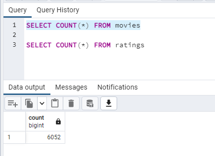
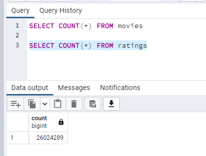
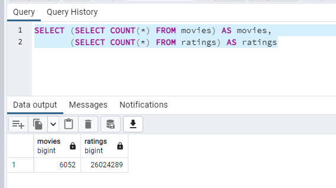

# Movies-ETL

## Overview of the Project:
Create an automated pipeline that takes in new data, performs the appropriate transformations, and loads updated movie data into existing tables.

## Summary:

### SELECT COUNT(*) queries

#### Showing table counts confirming that the database has been updated correctly through python

 

### Combining SELECT COUNT(*)

#### The counts for both tables can be queried with a single output table

